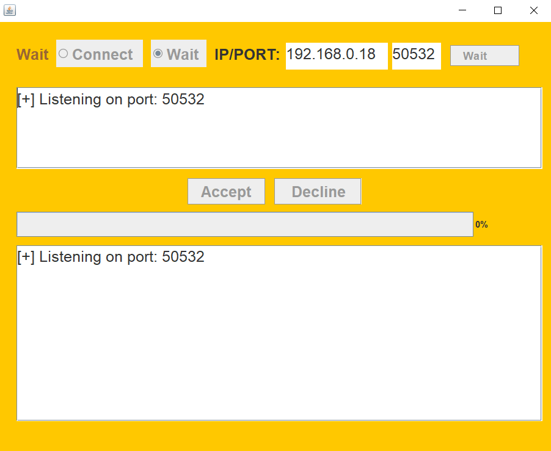
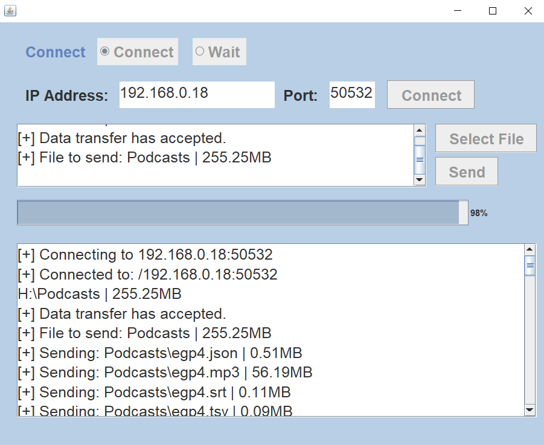
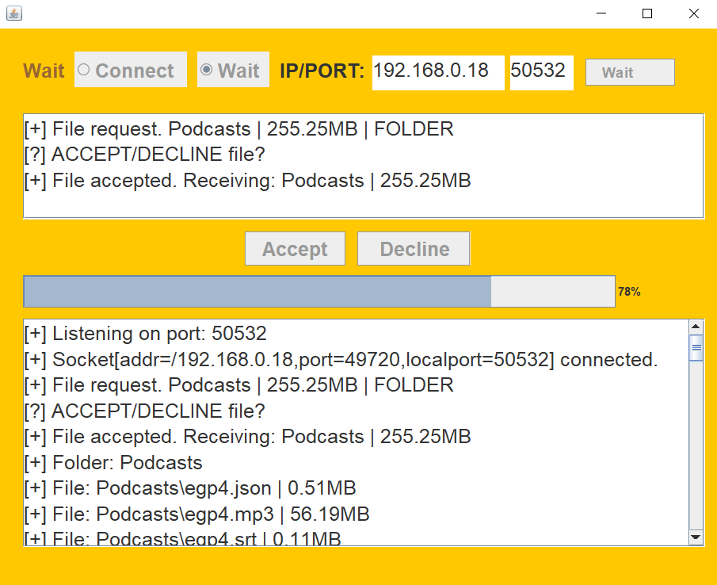

# JavaFX-FileTransfer

## Features

* Fast file and folder (also subfolders) transmission.
* Modern progress bar.
* Enhanced GUI.

## Future Updates
* Encryption for secure connections.
* Choose your file save location.
* Continuous GUI improvements.
* Some bugfixes.

## Installation

* Ensure Java 17 and Git are installed.
1. Clone the repository: `git clone https://github.com/samedokceci/JavaFX-FileTransfer.git`
2. Navigate to the directory: `cd JavaFX-FileTransfer`
3. Compile: `javac *.java`
4. Run: `java FileTransfer`

## Photos

